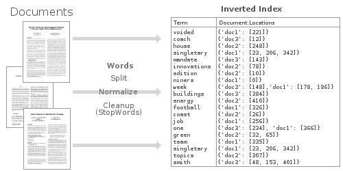

# Inverted Index

## **Overview**
- [How to retrieve a text document by query?](#how-to-retrieve-document-by-query?)
- [What is Inverted Index?](#what-is-inverted-index?)
- [Our Example](#our-example)

## How to retrieve document by query?

  Generally, we need to do some search on the web search services (google / yahoo / etc). To make these queries, we commonly use specific words that represent what we are looking for. But web search services return to us some documents / urls. How they can associate a set of words with complex documents?

  Our natural thought concludes: "***They search around all of document and verify if queries matches with some slice of document.Obviously!***".But if you think about this a little bit, have some problems with this reasoning. How they can make this query in seconds/milliseconds? Search big documents checking every word is computationally expensive.

  Fortunately, someone spent some time thinking about this and reached a conclusion. Our Inverted Index algorithm!

## What is Inverted Index?
  Inverted index is a classic algorithm used to create a relation between documents and word/phrases queries.

### How it works?
  Basically, we need to build a map of all words contained in all of our documents. Yes, this is computationally expensive, but we will transfer great part of process cost to start the application. Once started, we won't need to worry with query process cost.

  Later, for every word in our map, we need to create a link with documents id's that contains that word. In this way, we will have a map of words, where each word is associated with a list of documents.

  When someone make some query with one word, the cost to get all of documents that contains this word will be constant.

#### Trade-off's
- Reduce Query cost and create a solid struct between words and documents
- Increase Start application cost

## Our Example
  For our example, we have a set of news extracted from a brazilian newspaper as a documents. You can see my step-by-step solution [here](https://github.com/IonesioJunior/Information-Retrieval/blob/master/search_by_inverted_index/search_by_inverted_index.ipynb)!
